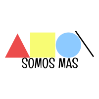
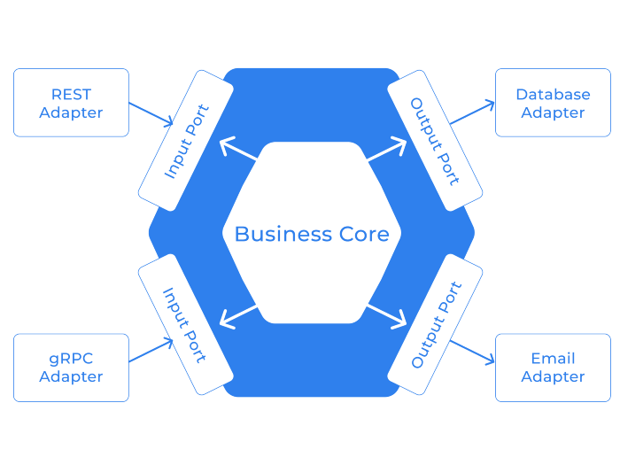

# OT276 Proyecto ONG - Somos Más

## Acerca del proyecto 📍

 

_Somos un equipo de desarrollo y nuestro líder técnico nos comparte el pedido de un cliente nuevo que está buscando nuestra ayuda. El pedido lo hizo Marita, la Directora de la ONG Somos Más, que está buscando desarrollar un sitio web para su organización._

_Marita y su equipo buscan que el sitio web funcione como carta de presentación, medio de contacto, y que les permita participar del concurso “Juntos por el Cambio Social”. Dicho concurso es organizado por una reconocida institución universitaria de Córdoba, Argentina, y el premio les permitiría ayudar a 150 familias extra por, al menos, los próximos 12 meses. Sin embargo, es requisito obligatorio para participar del concurso, incluir el link a un sitio web para dar visibilidad a su trabajo._

&nbsp;

### Objetivo del proyecto 📋

_Como parte de un equipo de desarrolladores, deberás desarrollar un sitio web que represente a la organización de Marita y el gran esfuerzo que su equipo realiza para la comunidad._

&nbsp;

### Overview de Requerimientos 🔧

* El equipo de Marita debe contar con un rol de usuario administrador para gestionar el sitio, sin necesidad de contactar a un técnico. Necesita poder seleccionar y actualizar la información a mostrar de cada sección (novedades, actividades, miembros, entre otras).

* Además, el sitio debe tener acceso público para que cualquier persona pueda recorrer las secciones e informarse acerca de la ONG, sin posibilidad de modificar la información disponible.

* Por pedido de Marita, les gustaría que el sitio tenga una sección para presentar a los miembros del equipo y las responsabilidades de cada uno. También, una sección donde se informe a la gente acerca de las actividades, últimas novedades, y testimonios de la ONG.

* Por último sería de gran utilidad, que el sitio web les permita ampliar su comunidad, invitando a interesados/as a contactarse con el equipo para participar como voluntarios/as, o bien para ser donantes de dinero y/o materiales.

&nbsp;

## Stack Tecnológico 🧰

* **Aplicación**: Java17, Maven, Spring Boot, Lombok, MapStruct.
* **Persistencia**: MySQL, Spring JPA, Hibernate, FlyWay.
* **Seguridad**: Spring Security, JWT.
* **Aplicaciones externas**: SendGrid, AWS S3.
* **Documentación**: Swagger.
* **Testing**: JUnit5, Mockito, Spring Testing, H2.

&nbsp;

## Entorno de Desarrollo 🚀

Estas instrucciones te permitirán poner el proyecto en funcionamiento en tu máquina local para propósitos de desarrollo y pruebas.

### Java 17

Vamos a estar utilizando la version 17 de java que, después de la 11, es la versión LTS (Long-Term Support) vigente.

Abajo se explica como descargarse e instalar la SDK ofrecida por Amazon, pero puedes utilizar aquella con la que te sientas más cómodo, siempre y cuando sea versión 17+.

Download Java 17: https://docs.aws.amazon.com/corretto/latest/corretto-17-ug/downloads-list.html

* Instalación windows: https://docs.aws.amazon.com/corretto/latest/corretto-17-ug/windows-7-install.html
* Instalación mac: https://docs.aws.amazon.com/corretto/latest/corretto-17-ug/macos-install.html
* Instalación linux: https://docs.aws.amazon.com/corretto/latest/corretto-17-ug/generic-linux-install.html

### Maven 3.8.5

Download Maven: https://dlcdn.apache.org/maven/maven-3/3.8.5/binaries/

* Instalación windows: https://mkyong.com/maven/how-to-install-maven-in-windows/
* Instalación mac: https://mkyong.com/maven/install-maven-on-mac-osx/
* Instalación linux: https://mkyong.com/maven/how-to-install-maven-in-ubuntu/

### Instalar IDE

IntelliJ es el IDE recomendado, pero puedes usar aquel con el que te sientas más cómodo.

> OPCIONAL: Si tienes email de la universidad (.edu) puedes aplicar a una licencia de estudiante gratuita para todos los productos de JetBrains incluido IntelliJ Ultimate: https://www.jetbrains.com/shop/eform/students

Te puedes descargar la versión community que es gratuita o la versión Ultimate si tienes la licencia mencionada arriba: https://www.jetbrains.com/idea/download

### Base de datos en contenedor de Docker (opcional)

Si tienes docker instalado puedes crear una instancia de MySQL que no necesita password.

Ejecutar el siguiente comando:

```sh
docker container run -d --name mysql -e MYSQL_ALLOW_EMPTY_PASSWORD=True -p 3306:3306 mysql
```

Verificar que esté levantado:

```sh
$ docker ps
CONTAINER ID   IMAGE       COMMAND                  CREATED        STATUS         PORTS                               NAMES
03d32959c701   mysql:8.0   "docker-entrypoint.s…"   3 seconds ago  Up 3 seconds   0.0.0.0:3306->3306/tcp, 33060/tcp   mysql
```

### Iniciar la aplicación

Una vez tengamos Java, Maven y MySQL en nuestro ambiente local, estamos en condiciones de iniciar la aplicación.

Instalar el proyecto maven en nuestro local, saltando los tests:

```sh
mvn clean install -DskipTests
```

Levantar la aplicación desde maven:

```sh
mvn spring-boot:run 
```

Verificar en el browser la documentación de la API en Swagger, con la url: http://localhost:8080/api/docs

&nbsp;

## Feature-branch Workflow 🌱

El flujo de trabajo asume una rama central "main" que representa la historia oficial del proyecto.

En lugar de trabajar directamente en la rama **main**, los desarrolladores crean una nueva rama (a partir del último commit en main) cada vez que comienzan a trabajar en una nueva funcionalidad (feature).

Las ramas de feature deben tener nombres descriptivos, por ejemplo *feature/OT276-X*. La idea es dar un propósito claro y muy enfocado a cada una. Además, las ramas de feature pueden (y deben) ser integradas a main mediante "pull-requests".

### Branches de corta duración

#### Features

Este tipo de branch lo utilizamos cuando estemos trabajando en una funcionalidad particular que se agrega a la aplicación.
> Ejemplo: **feature/OT149-123**

#### Refactors

Este tipo de branch lo utilizamos cuando no estemos agregando ningún tipo de funcionalidad, sino que modificamos nuestro código para que se más mantenible, escalable, perfomante o para mejorar la seguridad.
> Ejemplo: **refactor/OT149-124**

#### Bug Fixes

Este tipo de branch se utiliza para solucionar algún bug encontrado que necesita ser corregido en la rama principal.
> Ejemplo: **bugfix/OT149-125**

#### Hot Fixes

Este tipo de branch raramente se utiliza, significa que hay que solucionar un bug en producción que necesita ser integrado cuanto antes.
> Ejemplo: **hotfix/OT149-126**

#### Tests

Este tipo de branch se utiliza cuando queremos agregar tests automatizados a la aplicación.
> Ejemplo: **tests/OT149-127**

&nbsp;

### Branch de larga duración - main

Este flujo de trabajo, como ya mencionamos, consiste en una única rama de larga duración conocida como rama "main". Los desarrolladores crean nuevas ramas de corta duración cada vez que empiezan a trabajar en una nueva *feature/bug/refactor/test*.

Este tipo de flujo de trabajo es conocido como "trunk-based" y es una práctica común entre los equipos de DevOps, que requiere que los desarrolladores integren ramas de corta duración en un "tronco" central o rama principal.

#### Main (sin tags)
Esta rama se utiliza para el desarrollo. Cada desarrollador crea un branch desde lo último en main para trabajar en un *feature/bug/refactor/test*, luego va a subir un Pull Request para hacer merge de sus cambios en main, siempre **como un único commit (squash and merge)**.

#### Main con tag Release Candidate
Esta rama se utiliza para las pruebas de integración y demos. Cuando se quieren pasar suficientes cambios a release candidate se hace un "tag-cut" como se muestra a continuación:

> ***v1.0-rc1 -> v1.0-rc2 -> v1.0-rc3***.
Una vez que se produce el "tag-cut" los cambios son candidatos para la próxima release.

#### Main con tag Release
Esta es la rama que tiene el último código listo para producción. Una vez que todas las pruebas se han realizado y sabemos que estamos ante una versión estable, se hace un "tag-cut" de release como se muestra a continuación:

> ***V1.0-rc3 -> v1.0***.

&nbsp;

### Pull-requests

1. Para crear un PR, abrir en el navegador el repositorio en github.com e ir a la solapa que dice *Pull request* (a la derecha de *Issues*).
2. Luego seleccionar "New pull request", dejar el "base" en main y compararlo con el branch que queremos integrar.

3. Como título de PR usar la siguiente convención de nombre: **[#NRO-TICKET] Descripción breve**

Ejemplo:
> **[OT149-123] Added Users documentation**

4. Llenar en el *Pull-request Template* la información relevante sobre lo que modificamos en el código fuente.

&nbsp;

## Arquitectura 📐

La arquitectura hexagonal es un patrón arquitectónico para diseñar aplicaciones de software. Su popularidad ha aumentado en los últimos años por ser una alternativa a la arquitectura tradicional por capas.

### Core, ports, adapters

Este modelo sitúa toda la lógica de negocio en el **Core**, abstrayendo cualquier tipo de dependencia externa. Este aislamiento hace que la lógica sea mucho más fácil de probar y mantener.

En lugar de la capa de presentación, la aplicación tiene ahora uno o más adaptadores de entrada que manejan las peticiones del usuario. Del mismo modo, en lugar de la capa de persistencia, ahora tenemos uno o más adaptadores de salida que invocan aplicaciones o servicios externos, como un almacén de archivos en Amazon S3, un servicio de correo electrónico como SendGrid o, más típicamente, una base de datos.

El **Core** tiene uno o más puertos. Un puerto define un conjunto de operaciones que permiten al núcleo interactuar con los adaptadores y, por tanto, con lo que está fuera de la aplicación. Al igual que tenemos dos tipos de adaptadores, de entrada y de salida, hay un puerto de entrada y un puerto de salida. Los puertos de entrada son APIs expuestas por el núcleo para ser accedidas por aplicaciones externas, mientras que los puertos de salida son interfaces que permiten al núcleo consumir servicios externos.



&nbsp;

## Users and Roles

| User                          | Password            | Role   |
|-------------------------------|---------------------|--------|
| pedrojuarez@somosmas.org      | pedrojuarez123      | USER   |
| juanacosta@somosmas.org       | juanacosta123       | USER   |
| estebangarcia@somosmas.org    | estebangarcia123    | USER   |
| matiascarvallo@somosmas.org   | matiascarvallo123   | USER   |
| federicolopez@somosmas.org    | federicolopez123    | USER   |
| carolinagomez@somosmas.org    | carolinagomez123    | USER   |
| vivianagutierrez@somosmas.org | vivianagutierrez123 | USER   |
| belenvera@somosmas.org        | belenvera123        | USER   |
| zahirapiniero@somosmas.org    | zahirapiniero123    | USER   |
| rocioromero@somosmas.org      | rocioromero123      | USER   |
| ricardogrimaldi@somosmas.org  | ricardogrimaldi123  | ADMIN  |
| luismoretti@somosmas.org      | luismoretti123      | ADMIN  |
| manuelesposito@somosmas.org   | manuelesposito123   | ADMIN  |
| cristiancolombo@somosmas.org  | cristiancolombo123  | ADMIN  |
| oscarcarrasco@somosmas.org    | oscarcarrasco123    | ADMIN  |
| carlabenson@somosmas.org      | carlabenson123      | ADMIN  |
| elenamedina@somosmas.org      | elenamedina123      | ADMIN  |
| silvinatorres@somosmas.org    | silvinatorres123    | ADMIN  |
| monicaaranda@somosmas.org     | monicaaranda123     | ADMIN  |
| norazapata@somosmas.org       | norazapata123       | ADMIN  |

&nbsp;

## Links útiles 📖

* Documentación funcional: [Caso ONG](docs/Caso-ONG.pdf)
* Articulo sobre Feature-branch workflow: [The Feature-Branch Workflow on GitHub](https://manerajona.medium.com/the-feature-branch-workflow-on-github-d8b874725d8c)
* Articulo sobre Hexagonal Architecture: [Hexagonal Architecture on Spring](https://manerajona.medium.com/hexagonal-architecture-on-spring-a76c5be5039b)
* Articulo sobre FlyWay: [CI/CD databases with Flyway](https://manerajona.medium.com/ci-cd-databases-with-flyway-56a22dabd86)
* Guía para API REST: [5 steps for Well-Designed REST APIs](https://manerajona.medium.com/5-steps-for-well-designed-rest-apis-a9e429087267)

&nbsp;

## Integrantes del proyecto 👥

* **Emanuel Gonzalez** - *Developer* - [user](https://github.com/EmaGonzalezxd)
* **Juan Manuel Manchini** - *Developer* - [user](https://github.com/Juanchini23)
* **Matias Romero** - *Developer* - [user](https://github.com/matiaguro)
* **Nestor Flores** - *Developer* - [user](https://github.com/wilux)
* **Juan Pablo Cundere** - *Developer* - [user](https://github.com/{usuario})
* **Federico Oscar Acosta** - *Developer* - [user](https://github.com/FedeOA)
* **Leandro Amariles Perlaza** - *Developer* - [user](https://github.com/Yeyini7615)
* **Juan Esteban Castaño Holguin** - *Developer* - [user](https://github.com/{usuario})
* **Jonathan Manera** - *Tech Lead* - [user](https://github.com/manerajona)

&nbsp;
